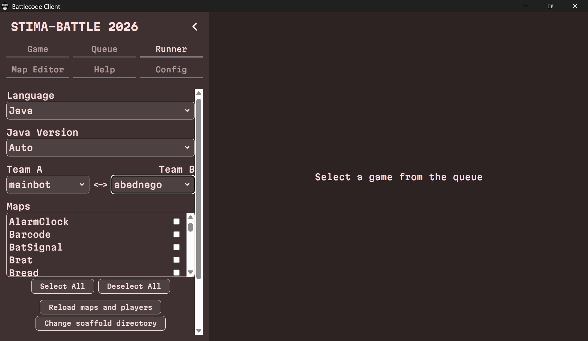
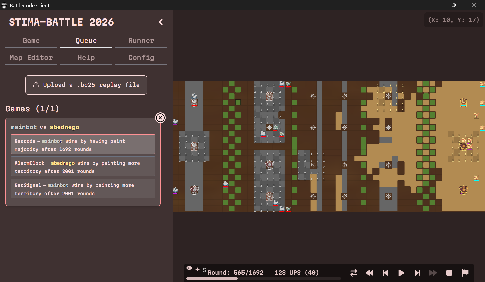

# Tubes 1 rokunana 

## Daftar Isi
- [Deskripsi Tugas Besar](#deskripsi-tugas-besar)
- [Penjelasan Singkat Algoritma](#penjelasan-singkat-algoritma)
- [Struktur Project](#struktur-project)
- [Getting Started](#getting-started)
- [Cara Menjalankan Pertandingan Antar Bot](#cara-menjalankan-pertandingan-antar-bot)
- [Kontributor](#kontributor)

## Deskripsi Tugas Besar
Tugas Besar 1 Strategi Algoritma bertujuan untuk mengimplementasikan algoritma greedy pada bot permainan Battlecode 2025. Untuk memenangkan permainan, bot harus mewarnai lebih dari 70% petak yang dapat diwarnai di peta atau menghancurkan semua robot dan menara milik tim lawan. Jika setelah 2000 ronde tidak ada pemenang, maka pemenang akan ditentukan berdasarkan urutan tiebreaker, yaitu luas area yang diwarnai, jumlah menara, jumlah chips, jumlah cat, dan jumlah robot. Setiap kelompok membuat tiga buah bot, yaitu bot utama, bot alternatif 1, dan bot alternatif 2, yang diimplementasikan dalam bahasa Java. Setiap bot memiliki strategi greedy dengan heuristik yang berbeda.

## Penjelasan Singkat Algoritma
Algoritma greedy adalah algoritma yang digunakan untuk memecahkan persoalan optimasi secara step-by-step sedemikian sehingga pada setiap langkah diambil pilihan yang optimal secara lokal tanpa memperhatikan konsekuensi pada langkah ke depannya.
1. Bot utama ()

2. Bot alternatif 1 ()

3. Bot alternatif 2 ()


### Struktur Project
```
Tubes1_rokunana
├───.gradle
├───artifacts\
├───build\
├───client\
├───gradle\
├───matches\
├───resource\
├───src\
│   ├───mainbot
│   ├───alternativebot1
│   └───alternativebot2
├───test\
├───.gitignore
├───build.gradle
├───client_version.txt
├───engine_version.txt
├───gradle.properties
├───gradlew
├───gradlew.bat
└───README.md
```

### Getting started

1. Clone repository ini
``bash
git clone https://github.com/nicholaswisee/Tubes1_rokunana
cd Tubes1_rokunana
``
2. Pastikan Java dan Gradle sudah terinstall:
``bash
java -version
gradle -version
``
Jika Gradle belum terinstall, ikuti panduan instalasi di [sini](https://gradle.org/install/).
3. Build project:
``bash
./gradlew build
``
4. Jalankan client
``bash
cd client
\\ Jalankan aplikasi client yang tersedia di folder client atau jalankan:
& '.\Stima Battle Client.exe'
``
5. Setelah client berjalan, pilih direktori Tubes1_rokunana sebagai root directory, bukan folder src.

## Cara Menjalankan Pertandingan Antar Bot
1. Pada menu runner, pilih bot yang akan menjadi Team A dan bot yang akan menjadi Team B. Lalu pilih peta yang diinginkan
   
2. Setelah memilih peta dan mengatur tim, tekan tombol run.
   .png)
3. Dari menu queue, kamu dapat melihat daftar pertandingan yang sedang berlangsung ataupun yang sudah selesai. Pilih pertandingan yang ingin direplay.
   
4. Pada menu game, kamu dapat melihat statistik setiap bot ketika pertandingan berlangsung.
   .png)
   .png)
   .png)

## Kontributor
| NIM      | Nama                           |
|:---------|:-------------------------------|
| 13524037 | Nicholas Wise Saragih Sumbayak | 
| 13524065 | Kurt Mikhael Purba             |
| 13524089 | Aurelia Jennifer Gunawan       |